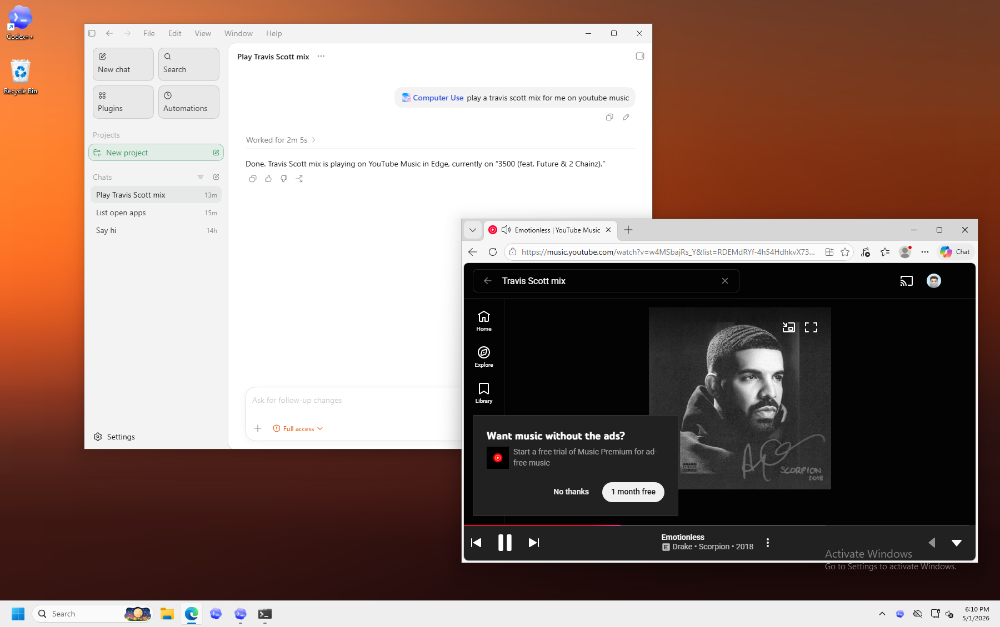

# Windows Computer Use

Codex++ tweak-plugin for a Windows Computer Use MCP surface.



This mirrors the Native Widgets layout:

- `manifest.json` declares a Codex++ tweak and an MCP server.
- `index.js` registers a small settings page in Codex++.
- `mcp-server.js` exposes stdio JSON-RPC MCP tools.
- `AppInstructions/*.md` holds app-specific operating guidance.

## Current State

This provides a Computer Use-compatible MCP surface for Windows desktop automation. It can list visible apps, capture app/window state, dump compact UI Automation targets, screenshot app windows, use app-specific instructions, press keys, type text, set UI values, and send click/drag/scroll events without moving the user's real cursor.

On non-Windows platforms the MCP server still starts and returns diagnostic JSON so development and tests can run from macOS.

## MCP Tools

- `windows_computer_use_status`
- `start_computer_use`
- `windows_computer_use_setup_check`
- `app_instruction_catalog`
- `list_apps`
- `get_app_state`
- `dump_app_targets`
- `screenshot_window`
- `click`
- `perform_secondary_action`
- `scroll`
- `drag`
- `press_key`
- `type_text`
- `set_value`
- `move_cursor`
- `show_fake_cursor`
- `hide_fake_cursor`

The tool names intentionally match OpenAI's macOS Computer Use where possible. The `start_computer_use`, `windows_computer_use_status`, and `app_instruction_catalog` tools are Windows helper tools for startup UI, diagnostics, and app-specific instruction discovery.

## Windows Setup

Windows does not use a macOS-style Accessibility permission prompt for this bridge. The setup work is mostly diagnostics and process context:

- Run Codex and the bridge at the same privilege level as the target app.
- Elevated/admin target apps require elevated Codex; normal apps should use a normal non-elevated Codex process.
- UAC secure desktop, lock screen, credential prompts, and some protected system surfaces cannot be automated reliably.
- Screenshots require an unlocked interactive desktop. Locked, minimized, or disconnected RDP sessions may return blank or stale captures.
- The bundled commands use `-ExecutionPolicy Bypass` for the current process, so persistent execution-policy changes should not be required.

Run:

```powershell
npm run setup:windows
```

The same checks are available through the MCP tool `windows_computer_use_setup_check`.

## Windows Bridge

The actual Windows work is isolated in `scripts/windows-bridge.ps1`. It uses:

- `System.Windows.Automation` for UI element tree capture and element-index lookup.
- `System.Drawing.CopyFromScreen` for per-window PNG screenshots.
- `user32.dll` for window focus, window targeting, and `PostMessage`-based click/drag/scroll dispatch that does not move the user's real cursor.
- `System.Windows.Forms.SendKeys` for key presses and literal text input.

The Codex++ main-process tweak starts `scripts/bridge-daemon.js` on Windows app launch. That daemon owns a persistent PowerShell/UIA bridge behind a local Windows named pipe, so the MCP server can reuse an already-warm bridge instead of creating a fresh cold PowerShell process on the first tool call. Set `WINDOWS_COMPUTER_USE_APP_LAUNCH_WARMUP=0` to disable app-launch warmup, or `WINDOWS_COMPUTER_USE_BRIDGE_DAEMON=0` to force the MCP server back to its own bridge process.

The MCP server also keeps a persistent PowerShell bridge process alive as a fallback on Windows, so UI Automation and .NET assemblies are loaded once per MCP session instead of once per tool call. It begins warming that fallback bridge after MCP initialization, and `start_computer_use` returns immediately with a visible "Starting Computer Use" event while any cold PowerShell/UIA startup continues in the background. Set `WINDOWS_COMPUTER_USE_PERSISTENT_BRIDGE=0` to fall back to one-shot bridge execution while debugging process lifetime issues, or `WINDOWS_COMPUTER_USE_PREWARM_BRIDGE=0` to disable MCP-session background prewarm.

`list_apps`, `get_app_state`, `dump_app_targets`, and `screenshot_window` include `appDisplay` metadata with a human display name, process name, window title, executable path, and an extracted PNG app icon path. Icon data URIs are opt-in with `includeIconData: true`; default responses avoid feeding base64 icon data into the model.

`get_app_state` returns a visible process/window match, app-specific instruction metadata, screenshot metadata, a compact accessibility tree, and a compact `actionableElements` list. By default, `accessibilityTree` is an array of concise lines and targets use short fields: `i` is the element index, `role` is the control type, `tool` is the recommended tool, `screen` and `window` are `[x,y]` center points, and `rect` is the window-relative `[x,y,w,h]`. Pass `includeRawAccessibilityTree: true` or `compact: false` only for bridge debugging. Screenshots are window-relative images with `screenOrigin` metadata; use target `screen` centers for absolute cursor movement/clicks, or pass `coordinateSpace: "screenshot"`/`"window"` when sending coordinates measured from the screenshot.

Target dumps merge three sources by default: normal UIA ControlView targets, high-value UIA RawView targets, and synthetic geometry/shortcut-backed targets for common app chrome. Browser windows expose `synthetic:browser-address-bar`, which can be clicked by geometry and can be passed to `set_value`; the bridge focuses the browser, sends Ctrl+L, and types the new value so the URL/search field is reliably cleared first. File Explorer exposes `synthetic:file-explorer-address-bar` and `synthetic:file-explorer-search`, backed by Alt+D and Ctrl+F. Disable these layers with `includeRawViewTargets: false` or `includeSyntheticTargets: false` only when debugging.

`dump_app_targets` is a lighter helper for testing. It skips screenshots and returns compact flattened clickable, editable, selectable, and scrollable targets with their positions. Pass `includeRawTargets: true` or `compact: false` only when you need the verbose target shape.

MCP responses for `list_apps`, `get_app_state`, and `dump_app_targets` expose compact line-oriented text instead of pretty JSON to reduce model/UI noise. The bridge still returns structured objects internally, and the MCP result keeps those objects in hidden `_meta.raw`. Pass `includeStructuredContent: true` only when debugging a client that needs visible exact fields.

`move_cursor`, `click`, `press_key`, and `type_text` return short app-scoped text summaries, and keep `appDisplay`, `presentation`, and action metadata in hidden `_meta`, so Codex++ can render progress such as “Microsoft Edge clicked …” or “Microsoft Edge typed text …” with the app icon instead of a bare JSON status. `press_key` and `type_text` also validate that the target app is the actual foreground process immediately before sending keyboard input. If the user changes focus and the target app cannot be foregrounded, the bridge refuses to send the key/text.

Virtual cursor work is wired through a persistent overlay:

- The original macOS `LensSequence` PNG frames are copied into `assets/macos-computer-use/LensSequence`.
- The original macOS `ComputerUseAssets.car` is copied into `assets/macos-computer-use/ComputerUseAssets.car`.
- The visible fake cursor defaults to the extracted macOS Computer Use cursor asset at `assets/macos-computer-use/cursor.png`.
- The fog/lens composition (`ComputerUseCursor`, `FogCursorStyle`, `SkyLensView`, `AgentCursor`) remains available as an experimental style, but it is not the default.
- `scripts/fake-cursor-overlay.ps1` runs as a click-through, topmost, no-activate mini overlay window.
- The overlay uses `UpdateLayeredWindow` with a 32-bit ARGB bitmap so fog/lens pixels keep real alpha instead of a transparency-key background.
- `move_cursor`, `click`, `show_fake_cursor`, and `hide_fake_cursor` update shared state and start/stop the overlay. `move_cursor` focuses the target app first when `app` is provided. `move_cursor` and `click` show the fake cursor by default unless `showFakeCursor: false` is passed.
- `move_cursor` moves the virtual cursor only by default. `click` dispatches UIA/window click events and does not move the user's real OS cursor.

See `assets/macos-computer-use/FAKE_CURSOR_UI_DUMP.md` for the extracted cursor UI symbol and asset notes.

## Registering the MCP with Codex

Until Codex++ forwards `manifest.json#mcp` into Codex's MCP runtime, add this to `~/.codex/config.toml` and restart Codex:

```toml
[mcp_servers.windows-computer-use]
command = "node"
args = ["/ABSOLUTE/PATH/TO/codex-plusplus-windows-computer-use/mcp-server.js"]
```

On Windows this will likely be:

```toml
[mcp_servers.windows-computer-use]
command = "node"
args = ["C:\\Users\\<you>\\AppData\\Roaming\\codex-plusplus\\tweaks\\co.bennett.windows-computer-use\\mcp-server.js"]
```

## Tests

```bash
npm test
```

On Windows, run the first interactive bridge smoke test with:

```powershell
npm run smoke:windows
```

That launches or reuses Notepad, lists visible apps, dumps `get_app_state`, prints actionable targets with positions, and exercises the layered fog cursor.
